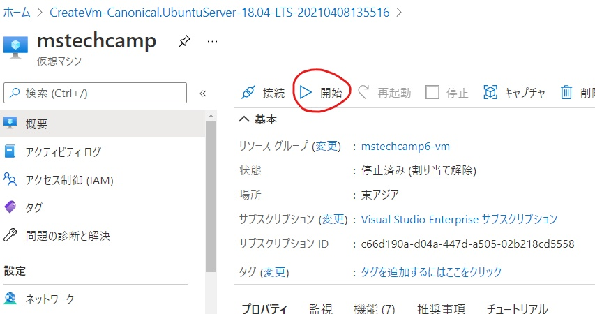

<h1> MS Tech Camp #6 </br>
Azure Virtual Machines で Minecraft Server を構築しよう！</h1>

[MS Tech Camp #6](https://mspjp.connpass.com/event/208491/) で使用するハンズオン資料です。

Azure Virtual Machines で Ubuntu の仮想マシンをデプロイし、 Minecraft Server を構築してマルチプレイで遊べるような環境を作ります。

## 1. Minecraft Launcher の設定
まずは、Minecraft 本体の設定を行います。

1-1 ゲームディレクトリをデスクトップ上に作成しておきます。

1-2 Minecraft Launcher を起動します。

1-3 画面上部の **起動構成** のタブを選択し、**新規作成** をクリックします。


1-4 必要事項を記入していきます。</br>
名前は自由です。バージョンは **1.16.5** を選択してください。ゲームディレクトリはデスクトップに作成したディレクトリを指定してください。

|項目|記入例|
|--|--|
|名前|mstechcamp|
|バージョン|release 1.16.5|
|ゲームディレクトリ|C:\Users\ <ユーザ名>\Desktop\mstechcamp|

<br>

記入できたら **作成** をクリックします。


1-5 プレイタブをクリックします

1-6 左下の起動構成選択から先程作成したものを選びます。

1-7 選択できたら **プレイ** をクリックしてゲームを開始します。


初回起動の場合はゲームのダウンロード (約300MB) が始まるので、この間に作業を進めます。

## 2. Azure Virtual Machines のデプロイ
[Azure ポータル](https://portal.azure.com/#home) にて Minecraft Server の基盤となる仮想マシンのリソースを作成していきます。

2-1 Azure ポータルから **リソースの作成** をクリックします。

2-2 検索欄に `ubuntu` と入力し、**Ubuntu Server 18.04 LTS** を選択します。


2-3 **作成** をクリックします。


2-4 必要事項を記入します。</br>
サイズの選択方法は表の下を参照してください。リソースグループ名、仮想マシン名、ユーザ名、キーの組名は自由に記入してください。

|項目|記入・設定例|
|--|--|
|サブスクリプション|Azure for Students|
|リソースグループ|mstechcamp6-vm|
|仮想マシン名|MinecraftServer|
|地域|(Asia Pacific)東日本|
|可用性オプション|インフラストラクチャ冗長は必要ありません|
|イメージ|Ubuntu Server 18.04 LTS - Gen1|
|Azure スポット インスタンス|なし|
|サイズ|Standard_B1ms|
|認証の種類|SSH 公開キー|
|ユーザ名|mstechcamp|
|SSH 公開キーのソース|新しいキーの組の生成|
|キーの組名|MinecraftServer_key|
|パブリック受信ポート|選択したポートを許可する|
|受信ポートを選択|SSH(22)|

</br>

**サイズの選択方法について** </br>
サイズは仮想マシンの性能を決めるための項目です。まずは **すべてのサイズを表示** をクリックします。


検索欄に `b1ms` と入力し、**Bシリーズ** から **B1ms** を選択します。


</br>

2-5 表の内容が記入できたら **確認および作成** をクリックし、**作成** をクリックします。


2-6 **新しいキーの組の生成** が表示されるので、**秘密キーのダウンロードとリソースの作成** をクリックします。


2-7 秘密キーをわかりやすい所に保存してください。（ここではデスクトップに保存しておきます。）

2-8 **リソースに移動** をクリックします。


2-9 仮想マシンのリソースの **停止** をクリックします。</br>
このとき、パブリックIPを予約するか聞かれますが、チェックを入れずに OK をクリックしてください。


2-10 リソースの概要ページ内にある **ネットワーク** の **パブリックIPアドレス** をクリックします。


2-11 **DNS名ラベル** の欄に任意の名前を入力します。（Minecraft Server への接続アドレスになります）

2-12 **保存** をクリックします。

2-13 パンくずリスト（画面上部）から仮想マシンのリソースに戻ります。


2-14 左側の項目欄から **ネットワーク** を選択します。

2-15 **受信ポートの規則を追加する** をクリックします。


2-16 受信ポートの設定を行います。下記のように記入してください。名前と説明は自由に記入してください。

|項目|記入例|
|---|---|
|ソース|Any|
|ソース ポート範囲|*|
|宛先|Any|
|サービス|Custom|
|宛先ポート範囲|25565|
|プロトコル|TCP|
|アクション|許可|
|優先度|310|
|名前|MinecraftServer_Port|
|説明|Minecraft サーバに接続するためのポートです。|

設定が完了したら **追加** をクリックします。

</br>

2-17 左側の項目から **概要** をクリックします。

2-18 **開始** をクリックして仮想マシンを起動します。



2-19 開始ボタンの左にある **接続** から **SSH** をクリックします。

2-20 サンプルコマンドをコピーしておいてください。


---
これで Azure ポータル上での作業は完了です！が、**まだポータルを閉じないでください。**

## 3. Minecraft Server の構築
次に、Minecraft Server を構築していきます。お使いのターミナルや PowerShell などの SSH 接続が可能なアプリを起動してください。（この資料では PowerShell を使用します。）

3-1 先程コピーしたコマンドの、`秘密キーのパス` を書き換えます。

```
ssh -i <秘密キーのパス> mstechcamp@mstech-minecraft.eastasia.cloudapp.azure.com
```

デスクトップに保存した場合の例 ↓

```
ssh -i C:\Users\<ユーザ名>\Desktop\<キーの組名>.pem mstechcamp@mstech-minecraft.eastasia.cloudapp.azure.com
```

秘密キーでの接続ができない場合は DNS 名の部分を IP アドレスに変更して接続してください。

3-2 書き換えたコマンドを実行して仮想マシンに接続します。</br>
下記のように聞かれたら `yes` と入力してください。

```
Are you sure you want to continue connecting (yes/no)?
```

このような画面になればログイン完了です。


3-3 パッケージをアップデートします。

```
sudo apt update
```

3-4 OpenJDK をインストールします。(Minecraft Server を動かすのに必要です)

```
sudo apt install openjdk-8-jdk -y
```

バージョンを確認する場合はこのコマンドを使用します。

```
java -version
```

このような表記になれば導入ができています。

```
openjdk version "1.8.0_282"
OpenJDK Runtime Environment (build 1.8.0_282-8u282-b08-0ubuntu1~18.04-b08)
OpenJDK 64-Bit Server VM (build 25.282-b08, mixed mode)
```

3-5 Minecraft Server 用のディレクトリを作成し、そのディレクトリに移動します。

```
mkdir MinecraftServer; cd MinecraftServer
```

3-6 Minecraft Server をダウンロードします。今回は Version 1.16.5 を使用します。</br>

```
sudo curl -LO https://launcher.mojang.com/v1/objects/1b557e7b033b583cd9f66746b7a9ab1ec1673ced/server.jar
```

3-7 Minecraft Server 起動ファイルを作成します。

```
sudo vim start.sh
```

今回は Vim というエディタを使用します。初めて使用する方は下記を参考にしてください。

<details><summary>Vim の使い方</summary>
<div>

vim でファイルを開くと、このような表示になります。</br>


ここで、キーボードの i キーを押すと挿入モードになります。挿入モードのときは左下に INSERT と表示されます。</br>


この状態で文字の入力を行うことができます。入力が終わったら、キーボードの ESC キーを押すと挿入モードが解除されます。

この状態で `:wq` と入力してエンターキーを押すと Vim が終了します。


</div>
</details>
</br>

3-8 以下の内容を `start.sh` にコピー＆ペーストし、保存して Vim を終了します。

```
java -Xmx1G -Xms1G -jar server.jar
```

3-9 ファイル実行権限を付与します。

```
sudo chmod o+x start.sh
```

3-10 Minecraft Server を起動します。

```
./start.sh
```

3-11 下記のようなエラーが表示されることを確認します。</br>
初回起動ではエラーが表示されます。これは利用規約 (eula) への同意が必要なためです。

```
[main/ERROR]: Failed to load properties from file: server.properties
[main/WARN]: Failed to load eula.txt
[main/INFO]: You need to agree to the EULA in order to run the server. Go to eula.txt for more info.
```

3-12 Vim にて eula.txt を開きます。

```
sudo vim eula.txt
```

3-13 `eula=false` を `eula=true` に変更して保存し、Vim を終了します。</br>
デフォルトでは下記のようになっています。もし、何も書かれていない場合は別のファイルを開いている可能性があります。
```
#By changing the setting below to TRUE you are indicating your agreement to our EULA (https://account.mojang.com/documents/minecraft_eula).
#Thu Apr 08 07:18:33 UTC 2021
eula=false
```

3-14 再度、Minecraft Server を起動します。

3-15 しばらくすると、`Done` と表示されます。これが表示されれば Minecraft Server の設定は完了です！

```
[Server thread/INFO]: Done (76.500s)! For help, type "help"
```

これでゲーム起動構成ファイルの設定は完了です！
## 4. マルチプレイの設定
次に、サーバへの接続設定を行います。

4-1 Minecraft にて **Multiplayer** を選択します。（初回起動は英語になっていますが、このまま進めます）

4-2 注意が表示されるので、`Proceed` をクリックして続行します。

4-3 **Add Server** をクリックします。

4-4 サーバの接続先を設定します。</br>
Server Name は自由ですが、Server Address は 仮想マシンの DNS名を使用します。Azure ポータルの仮想マシンリソースの概要ページに、DNS名が記載されているので確認してください。


この図の例を用いるとサーバアドレスはこのようになります。

```
mstech-minecraft.eastasia.cloudapp.azure.com:25565
```

DNS名の最後に `:25565` を追記してください。先ほど設定した受信ポートを使用して Minecraft Server へ接続します。

サーバ名とサーバアドレスが記入できたら **Done** をクリックします。


4-5 電波マークが緑色になっていることを確認してください。もし、緑色になっていない場合はサーバアドレスを間違えている可能性があります。


4-6 サーバを選択して、**Join Server** をクリックしてください。正しく設定できていれば、接続して遊ぶことができます！


これで今回のハンズオンの目標は達成です！お疲れさまでした！

### 友達と遊ぶには？
友達に **DNS名** と **ポート番号** をあわせたアドレスを教えて、手順 4-4 を行い、作成したサーバへ参加すると一緒に遊べます！
## 5. リソースグループの削除
Azure Virtual Machines は維持するだけでも若干の課金が発生するので、今後使用しない場合はリソースまるごと消去することをおすすめします。

5-1 Azure ポータルからハンズオンで作成したリソースグループを選択します。


5-2 **リソースグループの削除** をクリックします。削除するにはリソース名を記入します。

5-3 **削除** ボタンがアクティブになるので、これをクリックします。


これでリソースの削除は完了です！

## おわりに
今回は Azure Virtual Machines を用いて Minecraft Server の構築を行い、マルチプレイで遊べるようになるまでをやりました。これを更に応用して、マイクラを自動化するような方法を本にまとめたので、興味がある方はぜひ下記リンクをご覧ください。体験型のコンテンツとなっております。

[Azure × LINE Messaging API を用いた Minecraft 農業の自動化](https://zenn.dev/takunology/books/5c3375fcc105fc)

## アンケート
ハンズオンにご参加いただきありがとうございます。アンケートにご協力をお願いします。

[https://docs.google.com/forms/d/e/1FAIpQLSdhKNl75LplSI_iHIPFSb71zJgn0ix3PkUUgWgtmwBaqK6Lxg/viewform](https://docs.google.com/forms/d/e/1FAIpQLSdhKNl75LplSI_iHIPFSb71zJgn0ix3PkUUgWgtmwBaqK6Lxg/viewform)